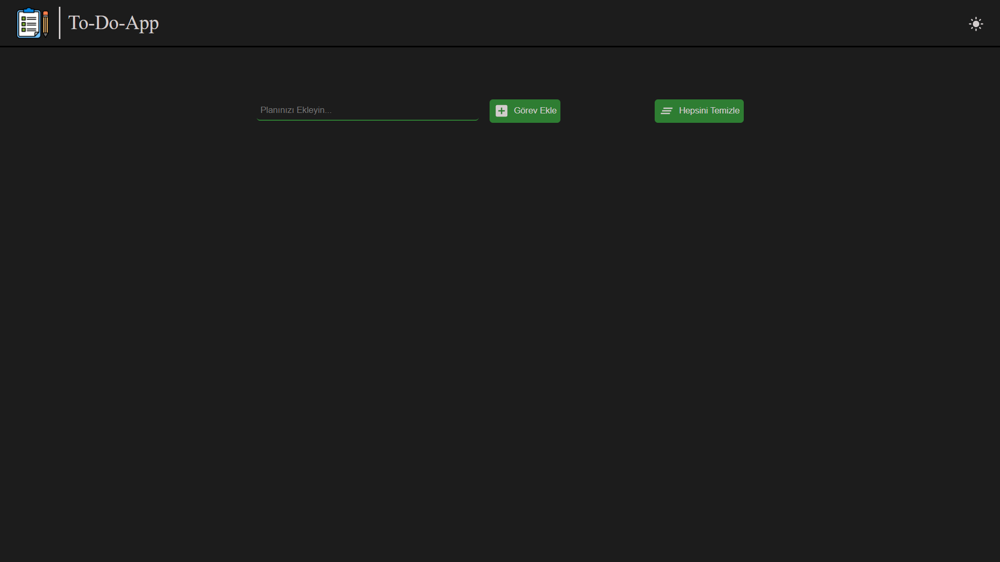
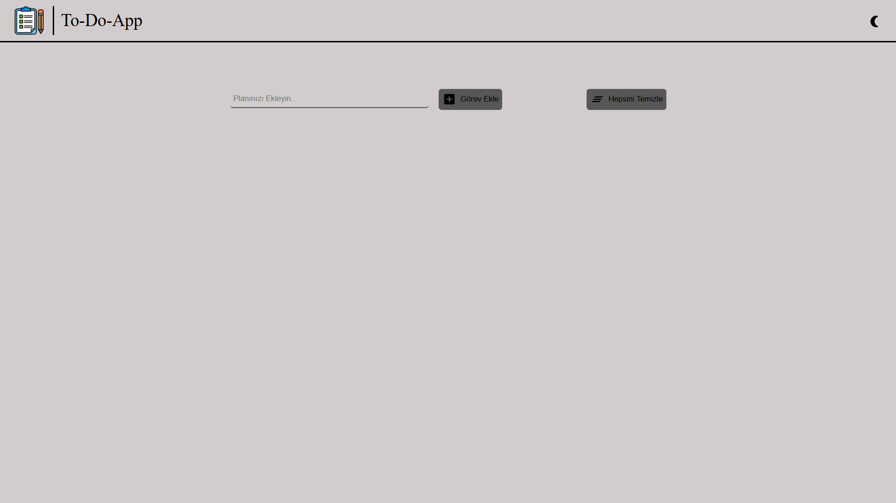
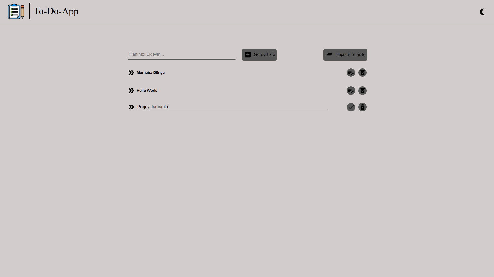
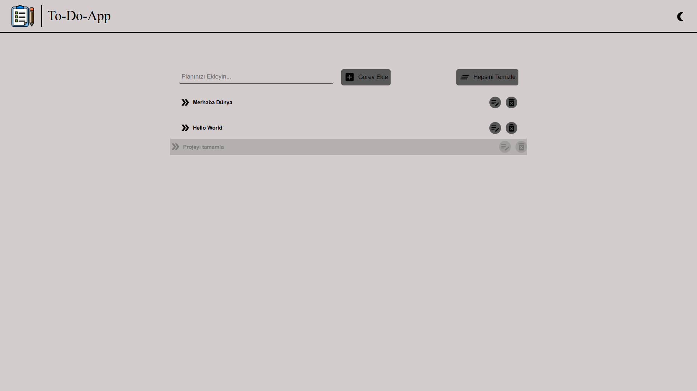

# ToDoApp

Kullanıcıların yapılacaklar listesini yönetebileceği modern bir ToDo uygulaması.

## Özellikler

- Görev ekleme, silme ve güncelleme
- Tüm görev listesini tek butonla silme
- Karanlık / aydınlık tema modları
- Kullanıcı dostu arayüz

## Kurulum

1. Depoyu klonlayın:
   ```sh
   git clone https://github.com/muratkaya12/ToDoApp.git
   ```
2. Bağımlılıkları yükleyin:
   ```sh
   npm install
   ```
3. Uygulamayı başlatın:
   ```sh
   npm run dev
   ```

# Ekran Görüntüleri

<p align="center">
  
  
  
  
</p>
